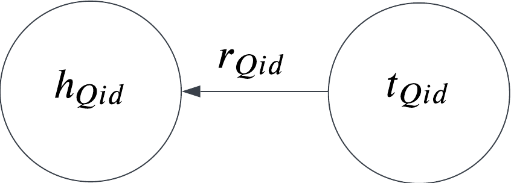
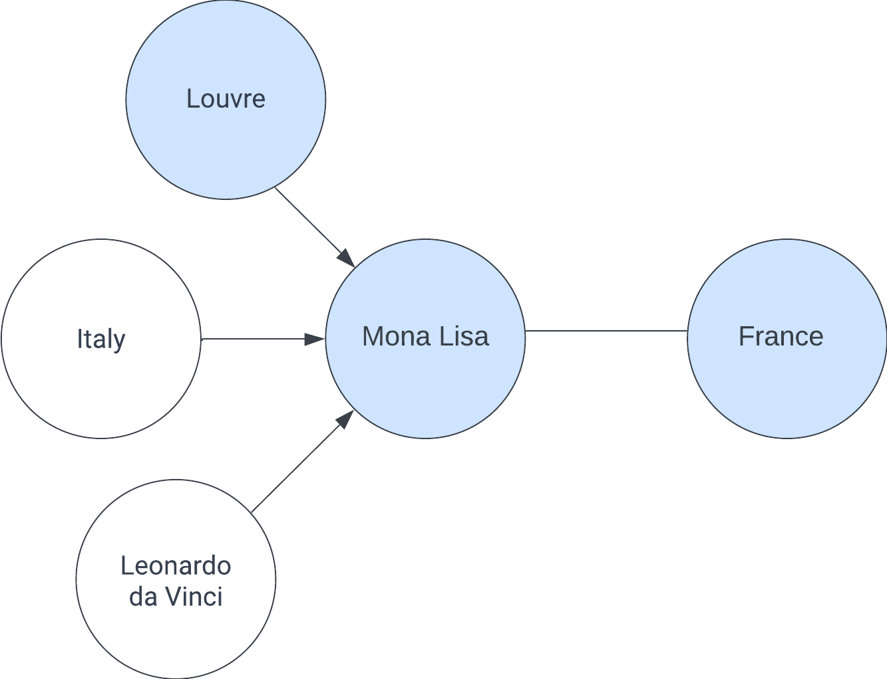

# Subgraph Sampling of Wikidata for Link Prediction

This is a guide to subraph sampling in a large interconnected knowledge graph for link prediction. 

## What is a Knowledge Graph? 

A knowledge graph is a mathematical graph consisting of nodes and edges. It represents enitites (concepts, objects, events, situations) as nodes and relations (semantic relations between nodes) as edges. 

## What is a Wikidata? 

Wikidata is a Knowledge Graph created from the Wikipedia pages, and is hosted by the Wikimedia foundation. It abstracts each article to a node and each hyperlink seen in articles to another article as a relation. These nodes are named Q id and the relations P id, and the graph is typically stored as a document of triples $(h,r,t)$. Where both $h,t$ are nodes in the graph while $r$ is the relation between them. 

As of 2023, Wikidata is the largest Knowledge Graph gathered. It consists of $~9$ million nodes and $~2$ billion edges. 

## What is Link Prediction? 

Link Prediction is the binary task of predicting whether an link (edge) is present or not between two nodes $h,t$. Conventionally, this approach does not make use of the 
relation $r$ between $h,t$ ,although there are approaches that do []; mainly for representation learning. 

## Why sample subgraphs? 

The most common use of Knowledge Graphs is to use Graph Neural Networks (GNN) to use the neighborhood of a node to create a better representation. This is performed by different methods of message passing for the GNN to aggregate the signals from various neighbors. 

Let's look at an example where of the link $h$ *Mona Lisa* (a painting by the italian Leonardo da Vinci located in the art gallery Louvren in Paris, France) and the tail *France*.  

The expectation is that during the training process, the Louvre node would have incorporated the France node into its representation. Such that, when the aggregated representation for Mona Lisa is gathered and the model attempts to perform link prediction, it will infer a link between the Louvre and France. Therefore, we anticipate that over time, the nodes will learn to integrate representations from their neighbors. This method of generating logic is referred to as semantic inference.

## Challenges with Subgraph Sampling for Link Prediction

The main challenges with subgraph sampling is *Data leakage* and large-scale dataset. 

### Data leakage

 There are two types of data leakage while predicting for $h,t$ on a graph $G$. 

- Direct data-leakage. When either of the sampled subgraphs $S_h, S_t \subseteq G$ contain the other node $h \in S_t$ or  $h \in S_h$. This means the signals could be directly propagated from the other node, causing the model only to focus on that node and not learn. 

- Indirect data-leakage. If there is a path between $h,t$ between the combined subgraph $S_{combined} = S_h \cup S_t$. 

While this may lead to optimistic results, which may not be cause for concerns at first glance, the model will have impaired generalization. To measure how well it generalizes, *Inductive Link Prediction* is often used. Inductive Link Prediction introduces a previously unseen set of nodes $C$ and performs prediction on $h,t$ where $h \in G$, $t \in C$.  Contrary to the previous method called *Transductive Link Prediction* where all nodes are seen. 

### Large-scale dataset

What the Data Leakage infers is that 

[0] https://arxiv.org/pdf/1902.10197.pdf
